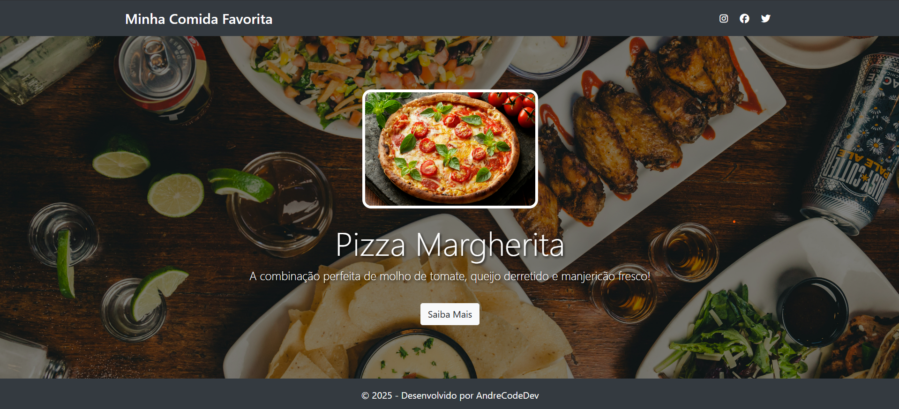

# 📘 Atividade Prática – Front-End | Minha Comida Favorita

**Disciplina:** Linguagens de Programação – AS009TSN1  
**Tema:** Introdução ao Mundo Front-End  
**Prazo de Entrega:** 29/08/2025

## 🧑‍💻 Descrição da Atividade

Este projeto é parte da atividade prática da disciplina de Linguagens de Programação e tem como objetivo introduzir os alunos ao desenvolvimento Front-End utilizando **HTML5**, **CSS3** e **Bootstrap**.

A proposta é criar uma página simples e funcional com o tema **"Minha Comida Favorita"**, explorando conceitos básicos de estruturação, estilização e responsividade.

---

## 📝 Requisitos Atendidos

- ✅ **Cabeçalho (Header)** com links para redes sociais usando ícones do Font Awesome.
- ✅ **Banner Principal** com:
  - Imagem da comida favorita.
  - Título e breve descrição.
  - Botão com link “Saiba Mais”.
- ✅ **Estilização com CSS:**
  - Fundo colorido no banner com sobreposição.
  - Texto centralizado com sombra.
  - Efeito de zoom ao passar o mouse sobre a imagem.
- ✅ **Responsividade:** Garantida com classes do Bootstrap.

---

## 📂 Estrutura de Pastas
minha-comida-favorita/
│
├── index.html
│
├── css/
│   └── style.css
│
└── img/
    └── pizza.jpg
    
---

## 💡 O que foi aprendido

Durante a construção deste projeto, foram aplicados e compreendidos os seguintes conceitos:

- A estrutura básica de um arquivo HTML.
- Estilização com CSS externo e aplicação de efeitos visuais.
- Inserção de imagens, botões, links e ícones com Font Awesome.
- Utilização do Bootstrap para responsividade e alinhamento.
- Organização de arquivos em pastas para um projeto limpo e escalável.

---

## ✅ Tecnologias Utilizadas

- HTML5  
- CSS3  
- Bootstrap 4  
- Font Awesome

---

## 📸 Prévia do Projeto

> *Link da Hospedagem: minhacomidafavorita.netlify.app*

---

## 📎 Autor

Desenvolvido por **André Vitor - ANDRECODEDEV** 👨‍💻  
Turma: AS009TSN1  
